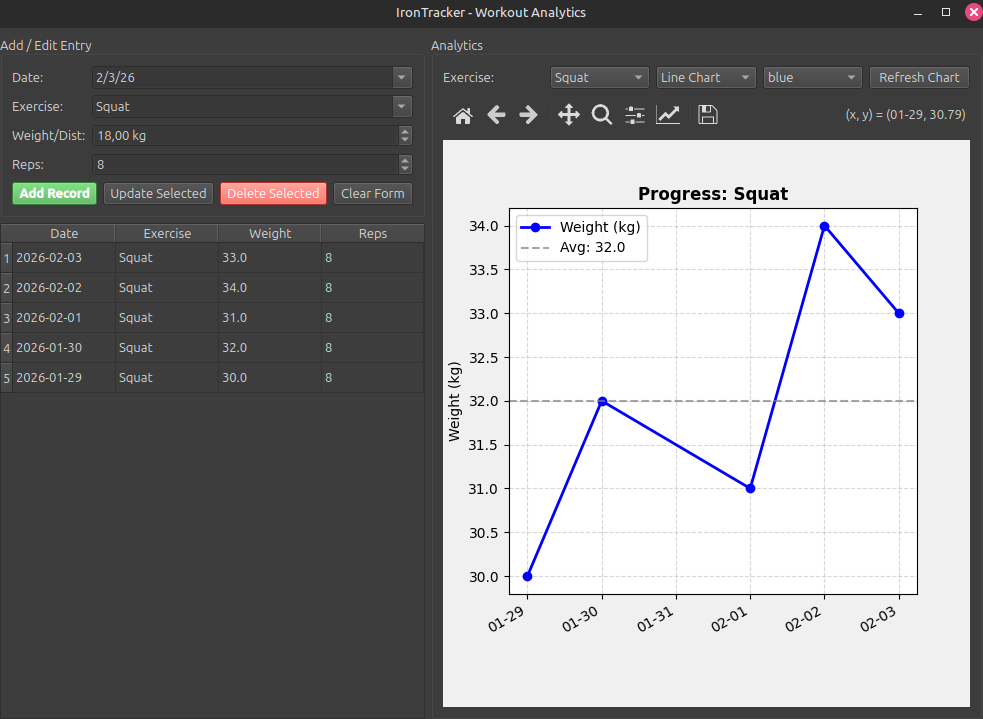

# IronTracker - Workout Analytics

A desktop application for tracking gym progress and visualizing performance data over time. Built with **Python**, **PyQt6**, and **Matplotlib**.

This project demonstrates full-stack desktop development capabilities: from SQLite database management to dynamic GUI construction and interactive data visualization.

## Dashboard Preview


## Features
* **CRUD Operations:** Add, Edit, and Delete workout logs (Date, Exercise, Weight, Reps).
* **Data Visualization:** Interactive charts powered by **Matplotlib** to visualize strength progression.
* **Dynamic Analytics:** Filter charts by exercise type, switch between Line/Bar graphs, and customize colors.
* **Persistent Storage:** Uses **SQLite** for reliable local data storage.

## Tech Stack
* **Language:** Python 3.10+
* **GUI Framework:** PyQt6 (Widgets)
* **Data Visualization:** Matplotlib
* **Database:** SQLite

## How to Run

1.  **Clone the repository**
    ```bash
    git clone https://github.com/Jahgodka/iron-tracker.git
    cd iron-tracker
    ```

2.  **Install dependencies**
    ```bash
    pip install -r requirements.txt
    ```

3.  **Run the App**
    ```bash
    python workout_tracker.py
    ```
